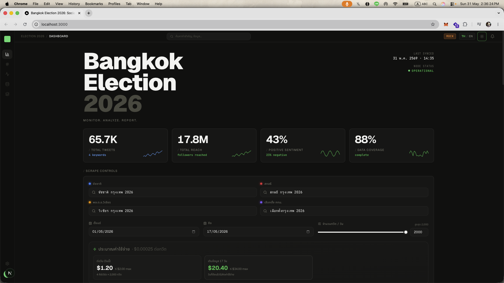

# 🗳️ Chadchart Social Listening — Bangkok Election 2026

A side-by-side X.com (Twitter) social-listening dashboard for the 2026 Bangkok
gubernatorial race. Pulls live tweets via Apify, runs Thai sentiment analysis
locally, and renders a polished comparison dashboard.



https://sirapakit.github.io/social-listening-bkk-election/ 

## What it does

- 🔍 Compares two candidate keyword bundles side-by-side (default: **ชัชชาติ** vs **ดร.โจ ชัยวัฒน์**)
- 📊 Metrics per keyword: **Buzz** (tweets), **Reach** (de-duped follower sum),
  **Engagement** (likes + retweets + replies + quotes), **Views**
- 💬 **Sentiment** (positive / neutral / negative) via a Thai lexicon classifier
  built on PyThaiNLP's tokenizer
- 📈 **Buzz over time** line chart, **Share of voice** split bar
- 🔥 **Top posts** (by engagement) with per-post sentiment chips
- 🧑‍🎤 **Top influencers** ranked by engagement, with profile pics
- # **Top hashtags** as a sized chip cloud
- 💰 Hard cost cap (`MAX_TWEETS_PER_KEYWORD`) so Apify spend stays predictable

## Architecture

```
┌──────────────────────┐         ┌──────────────────────┐
│  Next.js 16 frontend │ ──fetch │  FastAPI backend     │
│  Tailwind + Recharts │ ◀──────▶│  PyThaiNLP + Apify   │
│  http://:3000        │   JSON  │  http://:8000        │
└──────────────────────┘         └──────────┬───────────┘
                                            │
                                            ▼
                                  Apify run-sync API
                            kaitoeasyapi/twitter-x-…-cheapest
                                  $0.25 / 1k tweets
```

## Setup

### Prereqs

- **Node.js 20.9+** (for Next.js 16)
- **Python 3.11+** (3.13 verified). On macOS, use Homebrew, miniforge, or
  python.org — **NOT** the broken `/usr/bin/python3` SSL-less build.
- An **Apify API token** with credits

### 1. Configure secrets

Edit `.env` at the repo root:

```bash
APIFY_API_TOKEN=apify_api_…        # ← rotate from console.apify.com
APIFY_ACTOR_ID=kaitoeasyapi/twitter-x-data-tweet-scraper-pay-per-result-cheapest
MAX_TWEETS_PER_KEYWORD=500          # hard cost guard
DEFAULT_START_DATE=2026-05-01
```

### 2. Backend

```bash
cd backend
python3 -m venv .venv               # uses your default python3
.venv/bin/pip install -r requirements.txt
.venv/bin/uvicorn main:app --reload --port 8000
```

> If `python` is aliased to a different version in your shell rc, use
> `.venv/bin/python` and `.venv/bin/pip` directly.

### 3. Frontend (new terminal)

```bash
cd frontend
npm install        # first time only
npm run dev        # → http://localhost:3000
```

Open <http://localhost:3000>, optionally adjust keywords / dates / max-tweets,
hit **Refresh**.

## Cost control

Every keyword refresh costs `(maxTweets × keywords) × $0.00025`. The UI shows
the live estimate beside the Refresh button. Defaults:

| Setting | Value | Estimated cost per refresh |
| --- | --- | --- |
| 200 tweets × 2 keywords | default | ~$0.10 |
| 500 tweets × 2 keywords | cap | ~$0.25 |

`MAX_TWEETS_PER_KEYWORD` in `.env` is a hard server-side ceiling — the UI
cannot exceed it even if the user enters a larger number.

## File map

```
.
├── .env                          secrets + config (gitignored)
├── backend/
│   ├── main.py                   FastAPI app + /api/compare endpoint
│   ├── apify_client.py           Apify run-sync caller
│   ├── sentiment.py              Thai sentiment lexicon classifier
│   ├── aggregator.py             tweet → metrics reducer
│   ├── config.py                 env loader + candidate presets
│   └── requirements.txt
└── frontend/
    ├── src/app/page.tsx          dashboard root
    ├── src/components/
    │   ├── ControlsBar.tsx       keyword + date + max-tweets + refresh
    │   ├── KeywordPanel.tsx      per-candidate metric column
    │   ├── MetricCard.tsx        single big-number tile
    │   ├── SentimentDonut.tsx    pos/neu/neg donut
    │   ├── BuzzTimeline.tsx      multi-series timeline (Recharts)
    │   ├── ShareOfVoice.tsx      horizontal split bar
    │   ├── TopPosts.tsx          tweet list with sentiment chips
    │   ├── TopInfluencers.tsx    ranked authors
    │   └── HashtagCloud.tsx      sized hashtag chips
    └── src/lib/
        ├── api.ts                fetch helpers
        ├── types.ts              shared shapes with backend
        └── utils.ts              cn() classname helper
```

## How keyword queries work

The default queries combine candidate name, full name, X handle, and hashtag:

```
ชัชชาติ OR "ชัชชาติ สิทธิพันธุ์" OR @chadchart_trip OR #ชัชชาติ
"ดร.โจ" OR "ชัยวัฒน์ สถาวรวิจิตร" OR @ChaiwatPublic OR #ดรโจ
```

The backend automatically appends `since:<start> until:<end>` so Twitter
search filters by date server-side. You can edit any query live in the UI.

## How sentiment works

PyThaiNLP 5.x removed its built-in sentiment module, and the official
replacement (`thai-sentiment`) transitively pulls in PyTorch. To keep cold-start
fast and the install light, we use:

- **PyThaiNLP tokenizer** (`newmm` engine) to segment Thai text
- A curated **Thai + English sentiment lexicon** with ~150 high-signal political
  / colloquial terms
- **Negator handling** (`ไม่`, `ไม่ใช่`, `not` flip the next token's polarity)
- **Intensifiers** (`มาก`, `สุดๆ`, `very` multiply the score)
- **Emoji weights** (👍 / 👎 etc.)

Tested 10/10 on a mix of Thai political tweets including negation and
emoji-only polarity. To upgrade to a heavier transformer model later,
replace `classify()` in `backend/sentiment.py`.

## Why this Apify actor

We initially tried `apidojo/tweet-scraper`. It accepted requests but returned
`{noResults: true}` sentinels for every query — its underlying X session was
apparently broken at the time. `kaitoeasyapi/twitter-x-data-tweet-scraper-pay-per-result-cheapest`
worked first try with Thai queries, costs less ($0.25 vs $0.40 per 1k), and
honors Twitter's `since:`/`until:` operators inline in the query.

## Roadmap ideas

- Schedule periodic snapshots into a SQLite DB for week-over-week trends
- Word cloud visualization (data is already aggregated in `top_words`)
- Sentiment timeline (positive vs negative trend lines per candidate)
- Detect spike events (sudden hour-over-hour volume) and surface what triggered them
- Plug in Claude API for higher-quality sentiment + topic clustering
